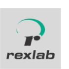

## Ramon de Brittos Souza

  
  
    hi.souzaramon@gmail.com
  

 

  
  
    https://www.linkedin.com/in/2bfe26
  

 

  
  
    https://github.com/2bfe26
  

 

  
  
    https://github.com/souzaramon
  

### About me

I got introduced to programming when I entered college, and I fell in love with this world. Since then, I've put in a lot of effort to improve my technical skills. I work as a full-stack developer, but I have an interest in all areas, from **DevOps**, **frontend**, and **backend**, to even **compilers**, **operating systems**, and **computer graphics**.

### Education

**Bachelor of Science in Information and Communication Technology** \
Universidade Federal de Santa Catarina • ongoing

### Work experience

**Full-stack Developer** \
[**Catho**](https://www.catho.com.br/) • Full-time • 02/2023 - Current • _9 months_ \
Skills: `AWS`, `Typescript`, `Node.JS`, `React.JS`, `Automated tests`

At Catho I learned about **team management**, **effective Scrum practices**, and the importance of **clear documentation**. This experience significantly expanded my knowledge, particularly in **microservices utilization**, fueling my desire for further **system design and architecture expertise**.

&nbsp;

**DevOps Engineer** \
[**Objective**](https://www.objective.com.br/) • Full-time • 03/2022 - 02/2023 • _1 year_ \
Skills: `AWS`, `Kubernetes`, `Docker`, `Terraform`, `ShellScript`, `Github Actions`

During my time at Objective, I joined the DevOps team and gained significant insights into **software quality**. Beyond clean and readable code, it encompasses **comprehensive testing**, application functionality assurance, **scalability** and **monitoring**. I ventured into Kubernetes, managing clusters and resources, while also exploring Docker and Shell scripting. Collaborating with **cross-functional teams**, I developed automation solutions and **created pipelines** using diverse technologies like Jenkins, GitHub Actions, and Bitbucket Pipelines. I contributed to **international projects** and delivered English presentations on testing to various teams.

&nbsp;

**Full-stack Developer** \
[**Ema**](https://ema.net.br/) • Full-time • 05/2021 - 04/2022 • _1 year_ \
Skills: `AWS`, `Typescript`, `Node.JS`, `React.JS`, `DynamoDB`

In this past career phase, I reengaged with Ema, tasked with creating a secure and efficient product prototype. Its goal was to centralize data from various companies through an API, enabling notifications and dynamic charts. I also designed apps for data consumption and resource registration within this API. This experience significantly enriched my knowledge in **AWS**, handling **sensitive data**, and ensuring **high-performance**, **highly available API maintenance**.

&nbsp;

**Full-stack Developer** \
[**Astrocoders**](https://astrocoders.com/) • Full-time • 12/2019 - 05/2020 • _6 months_ \
Skills: `AWS`, `Elixir`, `GraphQL`, `ReasonML`, `Postgresql`

During my time at Astrocoders, I immersed myself in Elixir development, a new language for me. I was responsible for constructing an API to consolidate payment methods and streamline transaction control. Despite a brief tenure due to the pandemic, this opportunity furnished me with precious insights into backend development, high-availability API techniques, and proficiency in working with Scrum methodologies. Additionally, it facilitated the daily enhancement of my English language skills.

&nbsp;

**Full-stack Developer** \
[**Ema**](https://ema.net.br/) • Full-time • 07/2019 - 12/2019 • _6 months_ \
Skills: `Typescript`, `Node.JS`, `React.JS`, `React Native`

Upon joining Ema, I actively contributed to the continuous development of the portal (Dox). During this period, I focused on enhancing this web application (React). Over the course of several months, I conducted a codebase restructuring, transforming it into a monorepo, where each system module became an independent package. Additionally, I successfully isolated the legacy portion and implemented a pipeline with unit testing and linting to ensure the overall application's quality.
Lastly, I introduced numerous bug fixes and performance enhancements to the application.

&nbsp;

**Full-stack Developer** \
[**JMV**](http://www.jmvsistemas.com.br/) • Full-time • 02/2018 - 07/2019 • _1 year and 6 months_ \
Skills: `Javascript`, `Node.JS`, `React.JS`, `React Native`, `Vue.JS`, `Mysql`, `Linux`

During my time at JMV Systems, I had the opportunity to create a wide range of applications, including APIs, Web Apps (PWAs), and jobs for ERP integration. These applications aimed to expand their functionalities and provide CRM and inventory control features at employees' fingertips.
Furthermore, this experience marked my first exposure to AWS and my specialization in JavaScript.

&nbsp;

**Full-stack Developer** \
[**RExLab**](https://rexlab.ufsc.br/) • Part-time • 12/2016 - 01/2018 • _1 year and 2 months_ \
Skills: `PHP`, `Node.JS`, `Mysql`, `Laravel`, `JQuery`, `Linux`

During my time as a researcher and developer at Rexlab, I had the opportunity to take my first steps in the web development world. I collaborated with a team in building and maintaining a fullstack Laravel application aimed at promoting inclusive education through physics experiments (Relle).
During this period, I was tasked with integrating a Node.js application for experiment access control. This integration involved implementing an in-memory queue system with the ability to prioritize users who had scheduled experiments.

### Skills

#### Experience in Software Development in Professional Environments

- Proficient in writing clean and efficient code, leveraging the full potential of the programming language. Familiar with concepts related to clean architecture. Understanding of both object-oriented and functional paradigms, and the utilization of design patterns when appropriate.
- Strong focus on test-driven development (TDD), including unit testing, integration testing, and end-to-end testing.
- Proficient in version control tools, with a keen understanding of the importance of GIT.
- Valuable experience in code reviews, maintaining a mindset that prioritizes the delivery of the highest quality code at all times.
- Proficient in tools and techniques related to Scrum (Agile) methodologies. Capable of organizing daily stand-up meetings, task management using Jira, and efficient asynchronous communication. A collaborative approach and a strong sense of teamwork.

#### Experience in Backend Development

- Proficient in Node.js frameworks, including AdonisJS, NestJS, ExpressJS, and Fastify, as well as in other languages such as Laravel (PHP), Phoenix (Elixir), and Django (Python).
- Skilled in relational databases like MySQL and PostgreSQL, as well as NoSQL databases such as MongoDB, DynamoDB, and Redis. Proficient in SQL, ORMs like TypeORM and Sequelize, and query builders like Knex.
- Experienced in high-traffic application development techniques, such as background jobs, message queuing systems (e.g., SQS, EventBridge), and microservices architecture.
- Proficient in monitoring tools like Grafana + Prometheus, Instana, and OpenSearch.

#### Experience in Frontend Development

- Profound knowledge of HTML, CSS, and DOM APIs.
- Proficient in developing responsive interfaces.
- Understanding of componentization and logic sharing between pages.
- Competence in JavaScript frameworks and libraries such as ReactJS, VueJS, SvelteJS, and SolidJS.
- Skilled in state management using libraries like Redux, xstate, and Zustand.
- Proficient in handling asynchronous operations, utilizing libraries like react-query and redux-saga.
- Proficient in error handling and recovery techniques, including Error Boundaries, action rollbacks, and offline queues.
- Experience with monitoring tools such as Instana and Sentry.

#### Experience in DevOps

- Understanding of the importance of containerization technologies, including the creation of Dockerfiles, Helm charts, and Kubernetes cluster management.
- Infrastructure management with Terraform.
- Proficient in creating CI/CD pipelines for various environments.
- Proficient with monitoring applications
- Strong focus on automating repetitive tasks.
- Proficient in and knowledgeable about Linux systems.

#### Extra

- Full-stack development using frameworks like Next.js and Meteor.js.
- Holistic thinking with a strong sense of responsibility for the product from end to end.
- Experience working in distributed teams across different countries.
- A strong desire to learn and evolve as a developer.
- Pursuing studies in areas beyond web development.

### Keywords

> **Hey there, human! The next part is intended for the machines; your attention is not required.** However, if you come across this in the midst of five thousand resumes, perhaps it might be the reason.

Javascript, JS, ES5, ES6, ES2020, ES2021, ES2022, Typescript, Flow, Node.JS, Deno, Bun, BunJS, npm, yarn, turborepo, vite, webpack, babel, eslint, prettier, lerna, redux, react, react-router, react-query, axios, zustand, redux-saga, vuejs, mui, vuetify, vuex, pinia, svelte, solidjs, nestjs, nextjs, css, grid, flexbox, styled-components, tailwind, sass, less, pug, vitest, jest, fakerjs, tdd, playwright, cypress, yaml, json, api, restful, fetch, http, https, ssh, ssl, tls, elixir, python, azure, aws, sqs, sns, s3, route53, cloudfront, eventbridge, apigateway, terraform, jenkins, githubactions, bitbucketpipelines, linux, shellscript, bash, ubuntu, k8s, kubernetes, docker, CI, CD, jira, scrum, agile, helm, vscode, vi, vim, slack, insomnia, postman, dom, html, unittests, frontend, fullstack, backend, GraphQL, RESTAPI, Microservices, MySQL, PostgreSQL, MongoDB, Redis, SQL, NoSQL, Git, GitLab, Atlassian, Webpack, Nginx, Heroku, DigitalOcean, AWSLambda, Lambda, DevOps, Jenkins, TravisCI, CircleCI, GitHub, Bitbucket, Docker, Kubernetes, SOLID, WebSockets, PaaS, DevSecOps, JWT
